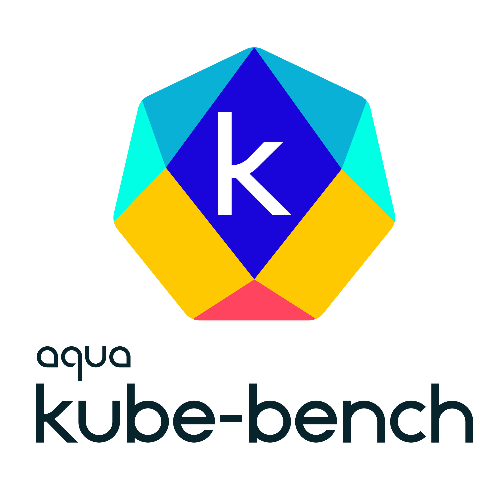
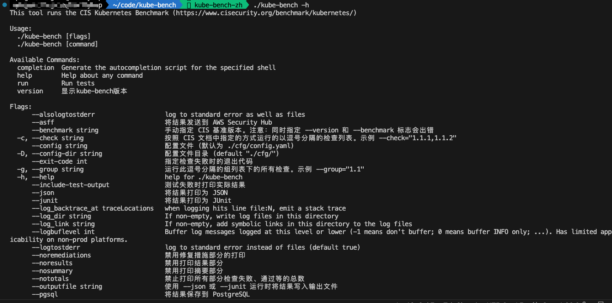
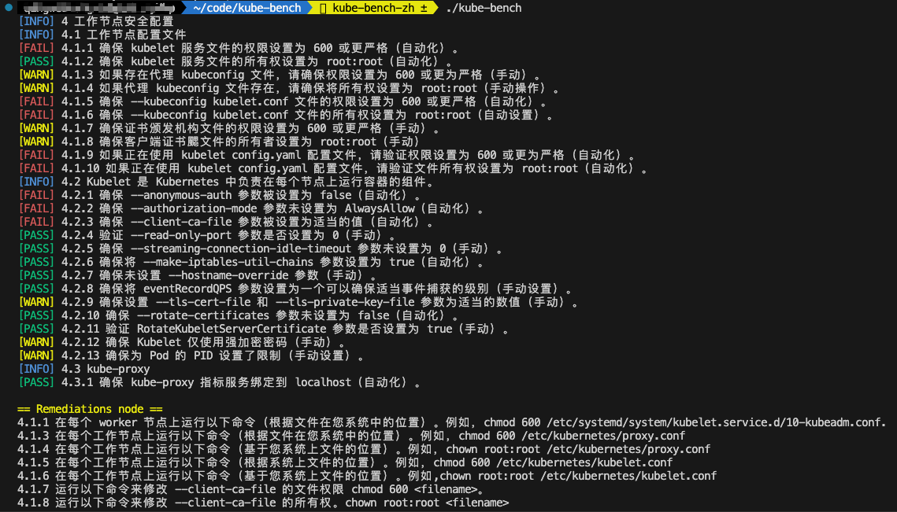

[![GitHub Release][release-img]][release]
[![Downloads][download]][release]
[![Docker Pulls][docker-pull]][docker]
[![Go Report Card][report-card-img]][report-card]

[![Coverage Status][cov-img]][cov]

[download]: https://img.shields.io/github/downloads/aquasecurity/kube-bench/total?logo=github
[release-img]: https://img.shields.io/github/release/aquasecurity/kube-bench.svg?logo=github
[release]: https://github.com/aquasecurity/kube-bench/releases
[docker-pull]: https://img.shields.io/docker/pulls/aquasec/kube-bench?logo=docker&label=docker%20pulls%20%2F%20kube-bench
[docker]: https://hub.docker.com/r/aquasec/kube-bench
[cov-img]: https://codecov.io/github/aquasecurity/kube-bench/branch/main/graph/badge.svg
[cov]: https://codecov.io/github/aquasecurity/kube-bench
[report-card-img]: https://goreportcard.com/badge/github.com/aquasecurity/kube-bench
[report-card]: https://goreportcard.com/report/github.com/aquasecurity/kube-bench

> kube-bench is a tool that checks whether Kubernetes is deployed securely by running the checks documented in the [CIS Kubernetes Benchmark](https://www.cisecurity.org/benchmark/kubernetes/).
>
> Tests are configured with YAML files, making this tool easy to update as test specifications evolve.

本项目对开源的[kube-bench](https://github.com/aquasecurity/kube-bench)做了汉化，方便日常工作处理。对于扫描结果的汉化，是通过编写python脚本调用chat-gpt 3.5的API对配置文件内容做了英译中，然后替换了对应的text和remediation字段内容。

- 命令参数注释汉化
- 扫描结果汉化

以下是命令参数的注释汉化效果图：

扫描结果汉化效果图：

